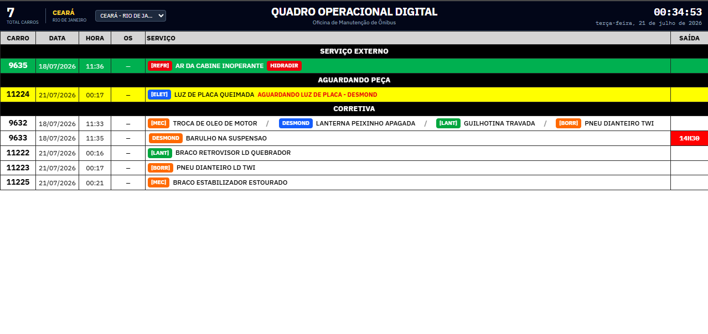
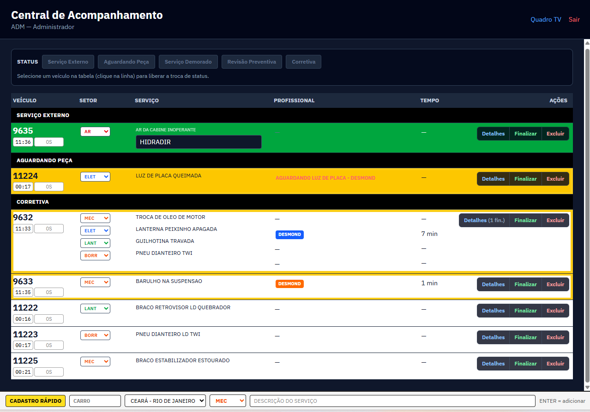
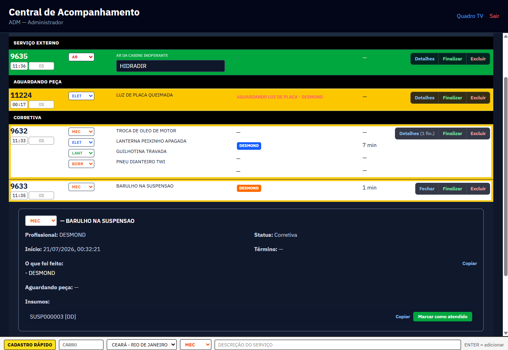
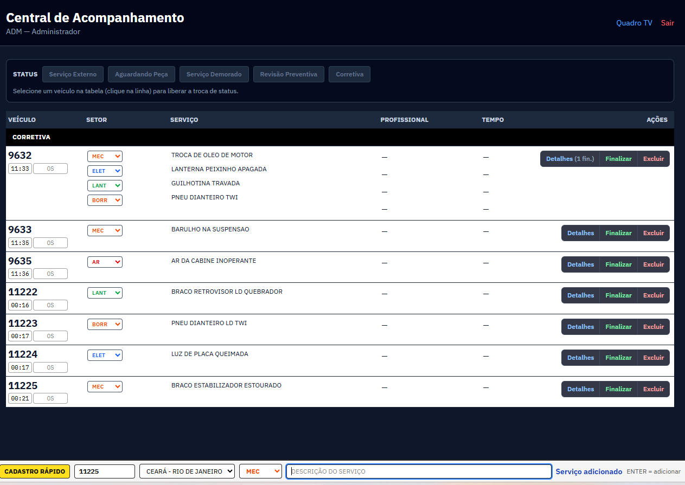
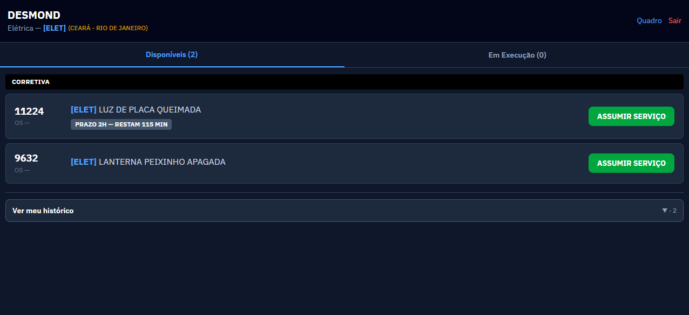
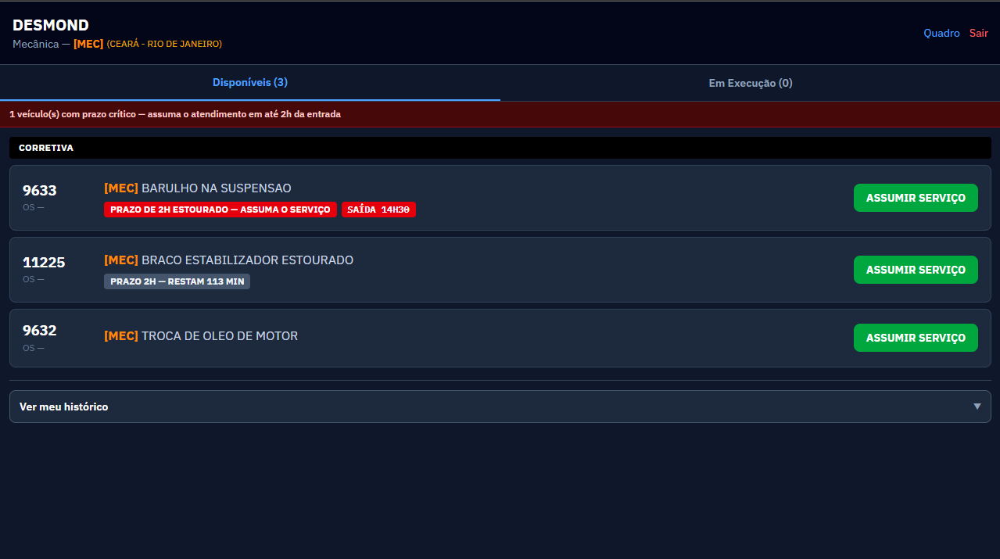
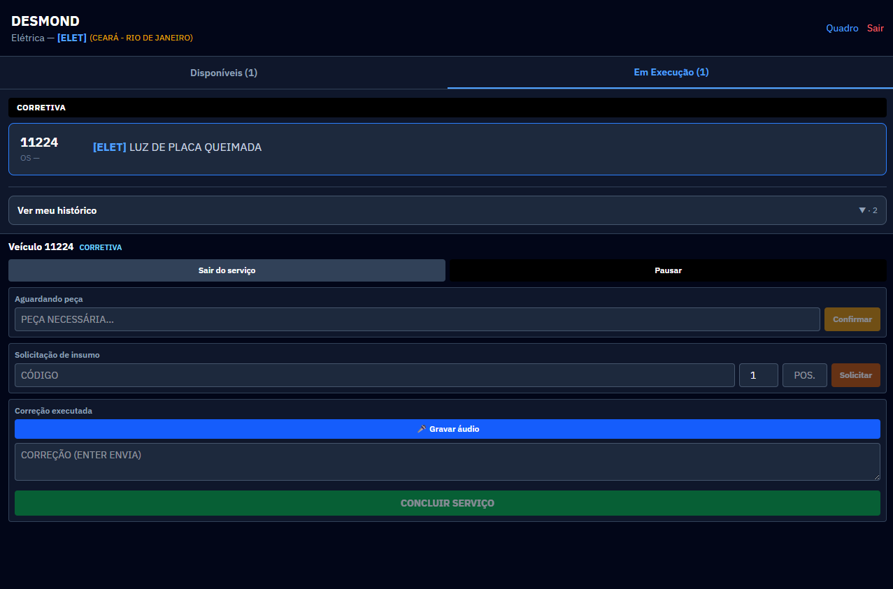
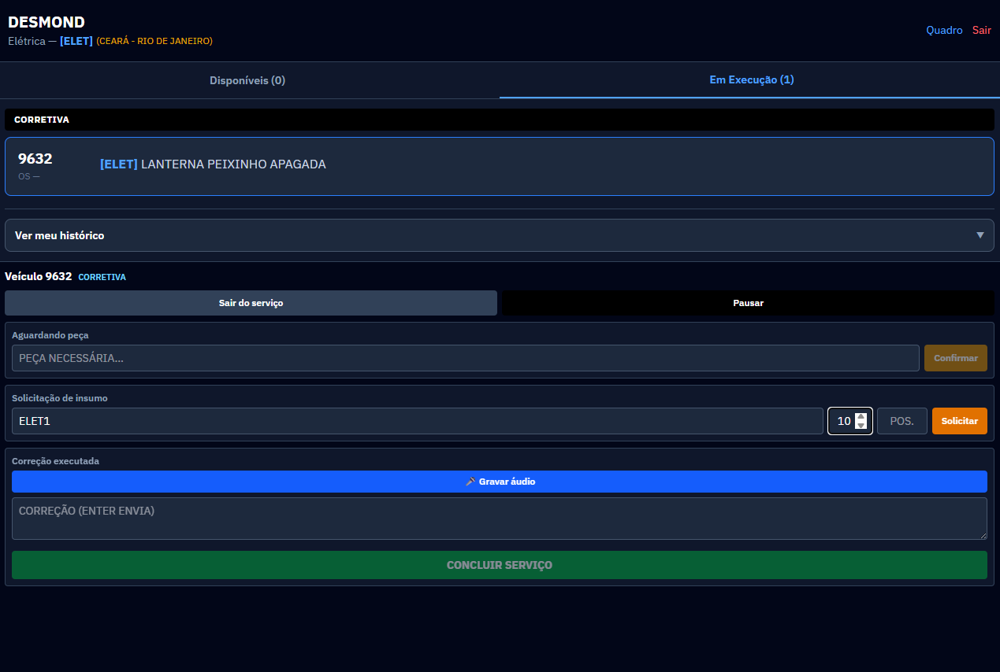
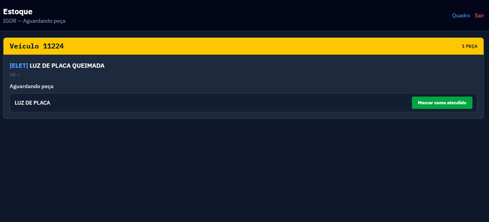

# Quadro Operacional Digital

Sistema web para controle e gerenciamento da manutenção de ônibus, substituindo planilhas Excel por um quadro operacional digital em tempo real.

## Stack

- **Frontend:** React, TypeScript, Tailwind CSS, Vite
- **Backend:** Node.js, Express, TypeScript
- **Banco:** PostgreSQL + Prisma ORM
- **Tempo real:** WebSocket
- **Autenticação:** JWT + RBAC

## Pré-requisitos

- Node.js 20+
- Docker (para PostgreSQL)

## Instalação

```bash
# 1. Subir o banco de dados
docker compose up -d

# 2. Instalar dependências
npm install

# 3. Configurar backend
cp backend/.env.example backend/.env

# 4. Rodar migrations e seed
npm run db:migrate
npm run db:seed

# 5. Iniciar desenvolvimento
npm run dev
```

### Banco limpo (desenvolvimento)

```bash
# Apaga todos os dados, reaplica migrations e roda seed de desenvolvimento
npm run db:reset

# Apenas garagens (recomendado após deploy / produção)
npm run db:seed:min
```

- **Frontend:** http://localhost:5173
- **Backend:** http://localhost:3001
- **Quadro TV:** http://localhost:5173/quadro

## Usuários de teste (senha: `admin123`)

| Matrícula | Perfil        | Setor        |
|-----------|---------------|--------------|
| ADM001    | Administrador | —            |
| GER001    | Gerência      | —            |
| MEC001    | Profissional  | Mecânica     |
| ELE001    | Profissional  | Elétrica     |
| LANT001   | Profissional  | Lanternagem  |
| PINT001   | Profissional  | Pintura      |
| REFR001   | Profissional  | Refrigeração |
| BORR001   | Profissional  | Borracharia  |
| CTR001    | Controler     | Serviços externos (todas as garagens) |

## Telas do sistema

| Rota            | Perfil         | Descrição                              |
|-----------------|----------------|----------------------------------------|
| `/quadro`       | Público        | Quadro operacional para TV 55"         |
| `/login`        | Todos          | Autenticação                           |
| `/admin`        | Administrador  | Central de acompanhamento              |
| `/profissional` | Profissional   | Assumir e executar serviços            |
| `/estoque`      | Estoque        | Atendimento de peças solicitadas       |
| `/gerencia`     | Gerência       | Indicadores, histórico e auditoria     |

### Quadro TV (`/quadro`)

Painel em tela cheia para exibição na oficina. Agrupa os veículos por status e destaca setores com badges coloridos.



### Central de Acompanhamento (`/admin`)

Painel do administrador: acompanha serviços por status, atribui profissionais, finaliza ou exclui OS e usa o **cadastro rápido** na barra inferior.



Clique em uma linha para abrir os detalhes do serviço (profissional, status, início, correções e insumos).



O cadastro rápido permite incluir veículo, garagem, setor e descrição sem sair da tela (`ENTER` = adicionar).



### Profissional (`/profissional`)

O mecânico/eletricista vê os serviços do seu setor em **Disponíveis** e assume o atendimento.



Prazos críticos aparecem em destaque (ex.: prazo de 2h estourado ou saída programada).



Com o serviço em execução, o profissional pode pausar, marcar aguardando peça, solicitar insumo, gravar áudio/correção e concluir.





### Estoque (`/estoque`)

Tela para quem atende solicitações de peça. Cada pedido aparece com o veículo e a descrição; ao entregar, use **Marcar como atendido**.



## Cadastro rápido (Quadro TV / Admin)

1. Informe o número do veículo, setor e descrição
2. **ENTER** — adiciona serviço à OS em elaboração
3. **ENTER + ENTER** — finaliza e salva a Ordem de Serviço

## Status visuais

| Cor     | Status                  |
|---------|-------------------------|
| Branco  | Em Execução / Corretiva |
| Vermelho| Parado Crítico          |
| Amarelo | Aguardando Insumo/Peça  |
| Roxo    | Serviço Demorado        |
| Azul    | Manutenção Preventiva   |
| Verde   | Serviço Externo / Finalizado |

## Estrutura do projeto

```
├── backend/          # API Node.js + WebSocket
│   ├── prisma/       # Schema e migrations
│   └── src/
│       ├── routes/   # Endpoints REST
│       ├── middleware/
│       └── lib/
├── frontend/         # React SPA
│   └── src/
│       ├── pages/    # Telas do sistema
│       ├── context/  # Autenticação
│       └── lib/      # API client
├── print/            # Capturas das telas (documentação)
└── docker-compose.yml
```

## Deploy (Docker)

```bash
# 1. Configurar variáveis de produção
cp .env.production.example .env
# Edite .env: POSTGRES_PASSWORD, JWT_SECRET, APP_PORT

# 2. Subir stack (PostgreSQL + API + frontend/nginx)
npm run deploy:up

# 3. Seed mínimo — garagens para o cadastro de usuários
docker compose -f docker-compose.prod.yml exec backend npx tsx prisma/seed-min.ts
```

- **App:** http://localhost:8080 (ou a porta definida em `APP_PORT`)
- **Quadro TV:** http://localhost:8080/quadro
- **Health API:** http://localhost:8080/api/health

Comandos úteis:

```bash
npm run deploy:logs    # acompanhar logs
npm run deploy:down    # parar containers
```

## Deploy na Vercel (frontend)

A Vercel hospeda o **frontend** (React). A **API**, **WebSocket**, **PostgreSQL** e **uploads** ficam no [Render](https://render.com) (arquivo `render.yaml` incluído).

### 1. Backend + banco (Render)

1. Suba o código no GitHub.
2. [Render Dashboard](https://dashboard.render.com) → **New** → **Blueprint** → selecione o repositório.
3. Após o deploy, copie a URL da API (ex.: `https://quadro-api.onrender.com`).
4. No serviço **quadro-api**, defina a variável `FRONTEND_URL` com a URL da Vercel (ex.: `https://seu-app.vercel.app`).
5. Rode o seed mínimo (Render Shell ou local com `DATABASE_URL` de produção):
   ```bash
   npx tsx prisma/seed-min.ts
   ```

### 2. Frontend (Vercel)

1. [vercel.com/new](https://vercel.com/new) → importe o repositório GitHub.
2. **Root Directory:** deixe a raiz do repo (usa `vercel.json` na raiz) **ou** defina `frontend` como root.
3. Variáveis de ambiente:

| Variável | Exemplo |
|----------|---------|
| `VITE_API_URL` | `https://quadro-api.onrender.com` |
| `VITE_WS_URL` | `wss://quadro-api.onrender.com/ws` |

4. **Deploy**.

- **App:** `https://seu-app.vercel.app`
- **Quadro TV:** `https://seu-app.vercel.app/quadro`

Desenvolvimento local continua sem essas variáveis (proxy do Vite para `localhost:3001`).

Volumes persistentes: `postgres_data` (banco) e `uploads_data` (fotos/áudios).

Para **zerar o banco em produção** (cuidado — apaga tudo):

```bash
npm run deploy:down
docker volume rm quadro-operacional-digital_postgres_data quadro-operacional-digital_uploads_data
npm run deploy:up
docker compose -f docker-compose.prod.yml exec backend npx tsx prisma/seed-min.ts
```
